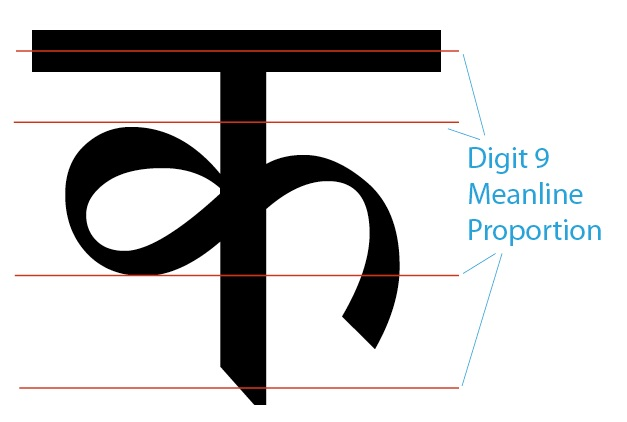

# PANOSE for Devanagari

Ben Bauermeister  
December 12th, 2014

License: <a rel="license" href="http://creativecommons.org/licenses/by-sa/4.0/">Creative Commons Attribution-ShareAlike 4.0 International License</a>

Source files available at [github.com/googlefonts/panose-devanagari](https://github.com/googlefonts/panose-devanagari)

## Introduction

This is the first publication version of the PANOSE classification scheme for Devanagari typeface designs.
Many thanks to the contributors who helped make this first version better and more understandable.
Your continued feedback is very welcome!
Please file issues at [github.com/googlefonts/panose-devanagari/issues](https://github.com/googlefonts/panose-devanagari/issues)

### Overview

The original PANOSE Classification System was developed to organize Latin typeface designs based solely on their visual characteristics. 
It was implemented with sufficient granularity to provide distinct classification for very similar fonts - e.g. differentiating Palatino from Book Antiqua. 
In this way PANOSE could be used for identifying, mapping and substituting typefaces. 
Mapping software was developed to find ‘similar’ designs. 

The Latin PANOSE scheme was later used as the backbone of an algorithmic synthetic font generation solution called Infinifont. 
The Infinifont engine was able to take the simplest 10 digit PANOSE number and create a fully formed and hinted TrueType or Type One PostScript font. 
It was this technology that allowed Hewlett-Packard to pack 110 fonts into their LaserJets in the early 1990s while reducing their onboard RAM memory costs.

Additionally, PANOSE was extended to classify Kanji typefaces and thus provide ‘Cross Script Mapping’ between Kanji and Latin typefaces to keep styles and color consistent between the two writing systems. 
At this time there is no mapping software that covers the new Devanagari classification scheme. 

This document details a classification scheme that would be compatible with the PANOSE Classifications System for Latin Type in order to classify Devanagari typeface designs. 
The classification system is intended to encompass both the traditional calligraphic styled faces and the more commercial drawn faces. 
It will not attempt to classify decorative faces directly - but through a ‘Treatments’ classification category (11th Digit). 

This document forms the framework and structure of the classification digits or ‘buckets’. 
As agreement is reached on these classification settings, additional refinement can help create the exact measurements and equations that define each of the classification categories. 

From there, it is a simple thought, albeit lots of hard work, to use these quantified metrics to create or modify a face based on these values. 

### References

Here are some additional resources to learn more about PANOSE and its associated technologies.

* Wikipedia  
  [en.wikipedia.org/wiki/PANOSE](http://en.wikipedia.org/wiki/PANOSE) 
* PANOSE 2 paper  
  [w3.org/Fonts/Panose/pan2.html](http://www.w3.org/Fonts/Panose/pan2.html)
* Infinifont paper  
  [cajun.cs.nott.ac.uk/wiley/journals/epobetan/pdf/volume6/issue3/beausol.pdf](http://cajun.cs.nott.ac.uk/wiley/journals/epobetan/pdf/volume6/issue3/beausol.pdf)
* PANOSE For the Web  
  [w3.org/Printing/stevahn.html](http://www.w3.org/Printing/stevahn.html) 
* HP Patent  
  [patentimages.storage.googleapis.com/pdfs/US5586241.pdf](http://patentimages.storage.googleapis.com/pdfs/US5586241.pdf) 
* “Red Book”  
  [amazon.com/Manual-Comparative-Typography-Panose-System/dp/0442211872](http://www.amazon.com/Manual-Comparative-Typography-Panose-System/dp/0442211872)

## PANOSE Classification System for Devanagari

In order to start thinking about the Devanagari PANOSE System we begin by referencing the existing Latin System. 
Below is an abbreviated chart of the current 16 characteristics that make up a Latin PANOSE classification number. 
Associated with each of these digits is the new attribute in Devanagari that will be measured, tracked, and classified. 

The ‘draw’ column indicates a Contour or a Geometry for each attribute. 
* C is used to indicate those attributes that pertain to the **Contour** of the design. 
* G indicates the attributes that affect the **Geometry** of the glyph shape. 

‘ord’ refers to the ordinal position of the digit, starting with 2. 
The first digit indicates the classification scheme, which in this case will be 7 for Devanagari. 

You will notice digit couplings at the end of the list, 7a and 7b for example. 
This is an artifact from the fact that originally several classification attributes were concatenated into a single digit. 
The numbers are still referenced this way.

#### PANOSE Latin with Devanagari Equivalents

| `draw` | `ordinal` | Latin...               | ...becomes in Devanagari                  |
|--------|-----------| -----------------------|-------------------------------------------|
| C      | 2         | Serif                  | Vertical Stem Terminal                    |
| C      | 3         | Weight                 | Weight                                    |
| G      | 4a        | Width                  | Width                                     |
| G      | 4b        | Proportion             | Glyph Shape                               |
| G      | 4c        | Monospaced             | Monospaced                                |
| C      | 5         | Contrast               | Contrast                                  |
| G      | 6a        | Stroke Speed           | Terminal Tapers                           |
| G      | 6b        | Stroke Angle           | Loop Closure                              |
| C      | 6c        | \- na -                | Knots                                     |
| C      | 7a        | Arm Tapers             | Stem Variation                            |
| G      | 7b        | Arm Terminals          | Stem Connection                           |
| C      | 8a        | Letterform             | Curvature                                 |
| G      | 8b        | Oblique                | Oblique                                   |
| G      | 8c        | \- na -                | Turns Speed                               |
| G      | 9a        | Midline                | Meanline Proportions                      |
| C      | 9b        | Apex Trim              | \- na -                                   |
| G      | 10a       | x-Height location      | \- na -                                   |
| G      | 10b       | Cap height conformance | Accent Space Allocation (Matra Placement) |

### PANOSE Devanagari Digit Details

Below is the detailed description of each classification digit and its new Devanagari attribute.
Where possible, similarities to the Latin settings are provided both for providing context and for indicating how Devanagari may map to Latin in the future.

#### (1) Family: 7, Devanagari

The first digit in a PANOSE classification number acts as a trigger to indicate which classification system is being used.
There are now 6 schemes for PANOSE that have been defined.

* 2 = Latin Text
* 3 = Latin Handwritten
* 4 = Latin Decorative
* 5 = Iconographic
* 6 = Kanji
* **7 = Devanagari**

#### (2) Vertical Stem Terminal

Devanagari and its ancestral scripts of Brahmi and Kutila have stone chiseled roots similar to Latin.
While the serif may not have been part of the original script grammar, they now occur from time to time.
Hence this digit principally tracks the aesthetic attributes of how the stroke is terminated, in addition to classifying the serifs where they occur.

* 0 = No fit
* 1 = Any
* 2 = Serifed  
  Any ornamentation to the vertical stem not conforming to pen shapes
* 3 = Hard Pen  
  Precisely drawn calligraphic vertical stem terminations
* 4 = Soft Pen  
  Loosely drawn calligraphic vertical stem terminations
* 5 = Chiseled Pen  
  Similar to #3, yet including beveled or complex corners (seen above)
* 6 = Gothic Square  
  90 degree, perpendicular treatments of vertical stem ends
* 7 = Gothic Round  
  Fully or partially rounded perpendicular treatments of vertical stem ends
* 8 = Flared  
  Simple widening of the vertical stem terminations

#### (3) Weight

Weight determines the overall color of the design by evaluating the main vertical stems of the font. This simple calculation carries over almost directly from the Latin system. 
It is likely that once the measurement system is defined for Devanagari that there will need to be some kind of an offset to Latin based on the increased glyph density in Devanagari.

* 0 = Any
* 1 = No fit
* 2 = Very Light   
* 3 = Light 
* 4 = Thin 
* 5 = Book
* 6 = Medium
* 7 = Demi 
* 8 = Bold 
* 9 = Heavy
* 10 = Black 
* 11 = Extra Black

#### (4a) Width

In the Latin scheme, this digit classifies 3 different visual traits. 
In Devanagari the traits are separated into individual parameters to begin with. The first trait, Width, characterizes the overall advance width of the design.

* 0 = Any  
* 1 = No fit  
* 2 = Very Condensed  
* 3 = Condensed  
* 4 = Normal  
* 5 = Very Extended  
* 6 = Very Condensed  

#### (4b) Glyph Shapes

Within the standard library of glyph shapes for Devanagari, there are several characters that alternate their design based on stylistic or historical references. 
This is similar to the way that Latin designs may alternate between a open loop and closed loop lowercase ‘g’ or a single story or double story lowercase ‘a’.

Work is still being done to better classify these shifts. 
Unlike Latin, where it is predominantly a style preference - the changes in Devanagari glyph designs seem to group together and represent a historical setting for the type. 
More information is needed to precicesly classify these traits.

* 0 = Any  
* 1 = No fit  
* 2 = Traditional 1  
  Conforming to the widely used glyph geometries  
* 3 = Traditional 2  
  Conforming to the alterate glyph geometries
* 4 = Script  
  Strong appearance of a handwritten nature  
* 5 = Simplified  
  Having several visual features diminished  
* 6 = Geometric  
  Based on an angular framework to the glyph geometries
* 7 = Westernized  
  Possessing several traits that are comparable to Latin design  

#### (4c) Monospaced

This single attribute indicates a design for which all of the glyphs have an identical advance width, similar to characters on early typewriters.

* 0 = Any
* 1 = No Fit
* 2 = Variable Width
* 3 = Monospaced

#### (5) Contrast

Contrast depicts the ratio of the thin segments of a stem to the thick areas. 
Some designs have strong variation between thick and thin, normally as a stem bends around a curve. 
Other designs have little or no variation.

* 0 = Any
* 1 = No Fit
* 2 = None 
* 3 = Very Low
* 4 = Low 
* 5 = Medium Low
* 6 = Medium 
* 7 = Medium High
* 8 = High 
* 9 = Very High

#### (6a) Terminal Tapers

In the Latin classification system Stroke Speed indicates how quickly a stem moves from thick to thin. 
A face like Bodoni normally has a very fast or strong stroke speed in that it moves from very thick to very thin in a short distance on a round stroke. 
In Devanagari we will measure how trailing stems and open curved strokes are tapered to classify this attribute.

* 0 = No Fit
* 1 = Any
* 2 = Strong Taper
* 3 = Medium Taper
* 4 = Low Taper
* 5 = No Taper
* 6 = Reverse Flare  
  Termination of the stroke widens instead of tapers
* 7 = Serifed Taper  
  Western or other ornamentation is added to the taper

#### (6b) Loop Closure

Several Devanagari glyphs have a folded over loop gesture at the end of lower curved components. 
These loops are also referred to as knots - but here a loop (ending a stroke) is differentiated from a knot (redirecting a stroke). 
Depending on the design and weight, these loops can be filled solid bulbs or clearly open counters. 

* 0 = No Fit
* 1 = Any
* 2 = Widely Open  
* 3 = Open
* 4 = Closed
* 5 = Simplified  
  Designates a shape, generally geometric, that is not calligraphically based
* 6 = Removed  
  Used when there is no indication of a looping stroke

#### (6c) Knot Appearance

Similar to the loops above, the knot is a strongly characteristic feature of Devanagari typographic design. 
Whereas the loop above is found at the end of a stroke and provides closure for the stroke’s energy, the knot is used to redirect the energy of a stroke through what is generally a 90° corner. 
Most often a knot will be closed with a soft triangular shape.

* 0 = Any
* 1 = No Fit
* 2 = Open Knots
* 3 = Closed Knots
* 4 = Flat Knot  
  Depicting a sharp triangular form
* 5 = Chiseled Knot  
  Shown as a beveled corner only, no extending triangle

#### (7a) Stem Variation

This attribute catches the rare, but often beautiful design aesthetic of complex stroke designs. 
In Devanagari designs this applies only to the vertical main stems that are present in many glyph geometries. 
Consistent = straight sides to vertical stems, and uniform width along the stem. 
Not bowed either. 
Non Straight = non-parallel, bowed stroke designs.

* 0 = Any
* 1 = No Fit
* 2 = Straight  
  Stem sides are straight and parallel
* 3 = Concave  
  Stem sides curve inward to thin the middle of the stem 
* 4 = Convex  
  Stem sides curve outward to make the stem plump
* 5 = Bowed  
  Stem sides curve in parallel to bow the stem
* 6 = Distorted  
  Stem sides are distressed, varied, or inconsistent in some way

#### (7b) Stem Connection

Counter closure, especially on the क (ka) character is a design decision in Devanagari. A range of fully closed, just touching, relaxed and open, to widely open is found in various font drawings. Similarly, at times serifs are added to the terminals of these counters when they are open. While many other characters have similar connection designs - the क (ka) glyph is evaluated here to set a general tone for the aesthetic of the design.

* 0 = Any
* 1 = No Fit
* 2 = Both Connected  
  Contact is made with the stem on both left and right loops
* 3 = One Disconnected  
  Contact is made only on one loop (generally the left loop)
* 4 = One Disconnected Widely  
  A wide gap occurs on the upper connection of the left loop
* 5 = Both Disconnected  
  Neither loop makes contact with the vertical stem

#### (8a) Curvature

In the Latin classification system Curvature is known as Roundness, yet both characteristics are very similar. This trait classifies the angular nature of the elliptical forms from being truly circular in form to curves with very angular corners. A perfect ellipse is a rare thing in a font design. Most designs pull on the corners of their round shapes to open the counters, giving a modern looking shape. 

* 0 = Any
* 1 = No Fit
* 2 = Round  
  True elliptical curvature
* 3 = Weighted  
  Corners are ‘pulled’ outward
* 4 = Boxed  
  Flattening occurs at the sides of the round shapes
* 5 = Rounded off  
  Flattening occurs at the tops and the sides of round shapes
* 6 = Sharply Squared  
  Round shapes are replaced with 4 or less flat segmented lines

#### (8b) Oblique

This digit captures the slant used in italic letter forms.

Note: Italic forms serve a different purpose in Latin than in Devanagari. Latin’s italic is used for emphasis, often for a single word. The slanted form of Devanagari is more typically used as a visual affectation of a whole piece of text, such as an entire title. 

* 0 = Any
* 1 = No Fit
* 2 = Upright  
  Where vertical stems are perpendicular to the baseline
* 3 = Oblique  
  Depicted by vertical stems that are noticeably slanting forward

### (8c) Turns Speed

The term Turns refers to the upper left shoulder curve in the glyphs of ह (ha) and इ (i). Traditionally, this curvature is abrupt after a long draw of the pen in the leftward direction. Other more modern designs simplify this curvature to a slow horseshoe shape. 

* 0 = Any
* 1 = No Fit
* 2 = Long Curvature  
  Typical of traditionally drawn designs
* 3 = Moderate Shoulder  
  Tight corner radius in comparison to attachment distance
* 4 = Soft Shoulder  
  Open corner turn with short connection to vertical stem
* 5 = Abrupt Shoulder  
  Very tight corner in comparison to attachment distance
* 6 = Sharp Corner  
  Geometric or pointed corner treatments

#### (9) Meanline Proportion

This measurement captures the overall allocation of geometric space below the headline in the Devanagari writing system. The upper and lower mean lines define the vertical space in which the strokes can reside. These theoretical lines divide the space between the headline and the baseline into 3 horizontal bands for aligning the stoke components in these areas. Similar to x-height in Latin, these mean lines can be pushed (raising the upper mean and lowering the lower mean) to open up the middle horizontal band for increased legibility.

* 0 = Any
* 1 = No Fit
* 2 = Large  
  Meanlines are unevenly distributed to create a larger space for strokes
* 3 = Regular  
  Meanlines are evenly spaces to create a balanced drawing space
* 4 = Low  
  Meanlines are tightened together to constrict the drawing space

#### (10) Accent Allocation

In some Latin designs the space normally reserved for placement of accent characters is so reduced that characters requiring an accent character are constrained in height to accommodate the vertical space of the accent. While this is very unlikely, in Devanagari display or advertising designs it is not uncommon to have the Matra space (the space above the headline) as well as the space below the baseline strongly compressed. There are different approaches in Devanagari to fit accent marks under the glyph. When space is restricted, the accent mark could be reduced or the glyph itself may be redesigned.

* 0 = Any
* 1 = No Fit
* 2 = Normal  
  Space is allocated for accents, similar characters are not redesigned
* 3 = Suppressed  
  Characters are modified to account for no accent space allocation

#### (11) Treatments

This new classification digit is intended to alleviate the need for a separate ‘decorative’ or ‘display’ typeface classification scheme. Often, a decorative face is just a treatment of an existing design. Faces that exhibit these characteristics can often be difficult to classify accurately across the other criteria. When classifying a design with additional treatments, one should strive to classify the traits of the implied font from which the final treatment was derived.

* 0 = Any
* 1 = No Fit
* 2 = Shadow  
  Containing a diffused or sharp shadow with or without a foreground font 
* 3 = Relief  
  A font with a three dimensional appearance
* 4 = Inline  
  Designs with ‘stroked’ stem edges that result in hollow stem interiors
* 5 = Contour  
  A font that has tracings around the exterior of its nominal form
* 6 = Straight Line  
  A font without curvature
* 7 = Distressed  
  Designs with malformed, antiqued, or deckled stem edges
* 8 = Reversed  
  Fonts drawn in the negative space

## Future Opportunities

### Font Mapping

One of the benefits of having a classification system for Devanagari is the ability to order and search fonts based on their similarity. 
While font mapping algorithms exist for the Latin PANOSE System, none have been created yet for the Devanagari. 
Typically, these mapping systems are comprised of distance tables that hold numeric values that indicate the distance of each value in a given trait to its neighbors. 
In addition to the distance tables are weight tables that are used to emphasize a given trait set over another (for example, the trait of Serif is weighted more highly than the trait of Apex Trimming). 
All the values in the distance tables need to be checked for proper triangulation to ensure that they are self-consistent.

### Cross Language Mapping

References are made throughout this classification description that draw connections to the Latin classification system. 
At this time no mapping scheme to connect these two classification systems exists (there have been cross-language mappers for Latin to Kanji). 
Similar to the font mapping described above - both specific distances and trait weighting capabilities are needed.

## Cheat Sheet

| 1 | Writing System     | 2 | Stem Terminal | 3  | Weight    | 4a | Width          | 4b | Glyph Shape   | 4c | Monospaced     | 5 | Contrast    | 6a | Terminal Tapers | 6b | Loop Closure | 6c | Knot Appearance | 7a | Stem Variation | 7b | Stem Connection       | 8a | Curvature    | 8b | Oblique | 8c | Turns Speed       | 9 | Meanline Proportion | 10 | Accent Allocation |
| - | ------------------ | - | ------------- | -- | --------- | -- | -------------- | -- | ------------- | -- | -------------- | - | ----------- | -- | --------------- | -- | ------------ | -- | --------------- | -- | -------------- | -- | --------------------- | -- | ------------ | -- | ------- | -- | ----------------- | - | ------------------- | -- | ----------------- |
| 0 | No Fit             | 0 | No Fit        | 0  | No Fit    | 0  | No Fit         | 0  | No Fit        | 0  | No Fit         | 0 | No Fit      | 0  | No Fit          | 0  | No Fit       | 0  | No Fit          | 0  | No Fit         | 0  | No Fit                | 0  | No Fit       | 0  | No Fit  | 0  | No Fit            | 0 | No Fit              | 0  | No Fit            |
| 1 | Any                | 1 | Any           | 1  | Any       | 1  | Any            | 1  | Any           | 1  | Any            | 1 | Any         | 1  | Any             | 1  | Any          | 1  | Any             | 1  | Any            | 1  | Any                   | 1  | Any          | 1  | Any     | 1  | Any               | 1 | Any                 | 1  | Any               |
| 2 | Latin Text         | 2 | Serifed       | 2  | Very Thin | 2  | Very Condensed | 2  | Traditional 1 | 2  | Variable width | 2 | None        | 2  | Strong Taper    | 2  | Widely Open  | 2  | Widely Open     | 2  | Straight       | 2  | Both Connected        | 2  | Round        | 2  | Upright | 2  | Long curvature    | 2 | Large               | 2  | Normal            |
| 3 | Latin Script       | 3 | Hard Pen      | 3  | Thin      | 3  | Condensed      | 3  | Traditional 2 | 3  | Monospaced     | 3 | Very Low    | 3  | Moderate Taper  | 3  | Open         | 3  | Open            | 3  | Concave        | 3  | One Disconnected      | 3  | Weighted     | 3  | Oblique | 3  | Moderate Shoulder | 3 | Normal              | 3  | Suppressed        |
| 4 | Latin Decorative   | 4 | Soft Pen      | 4  | Light     | 4  | Normal         | 4  | Script        |    |                | 4 | Low         | 4  | Low Taper       | 4  | Closed       | 4  | Closed          | 4  | Convex         | 4  | One Disconnected Wide | 4  | Boxed        |    |         | 4  | Strong Shoulder   | 4 | Small               |    |                   |
| 5 | Latin Iconographic | 5 | Chisled Pen   | 5  | Book      | 5  | Extended       | 5  | Simplified 2  |    |                | 5 | Medium Low  | 5  | No Taper        | 5  | Simplified   | 5  | Flat            | 5  | Bowed          | 5  | Both Disconnected     | 5  | Rounded Off  |    |         | 5  | Abrupt Shoulder   |   |                     |    |                   |
| 6 | Kanji              | 6 | Gothic Square | 6  | Medium    | 6  | Very Extended  | 6  | Geometric     |    |                | 6 | Medium      | 6  | Reversed Flare  | 6  | Removed      | 6  | Chiseled        | 6  | Distorted      |    |                       | 6  | Sharp Square |    |         | 6  | Sharp Corner      |   |                     |    |                   |
| 7 | Devanagari         | 7 | Gothic Round  | 7  | Demi-bold |    |                | 7  | Westernized   |    |                | 7 | Medium High | 7  | Serifed Taper   |    |              |    |                 |    |                |    |                       |    |              |    |         |    |                   |   |                     |    |                   |
|   |                    | 8 | Flared        | 8  | Bold      |    |                |    |               |    |                | 8 | High        |    |                 |    |              |    |                 |    |                |    |                       |    |              |    |         |    |                   |   |                     |    |                   |
|   |                    |   |               | 9  | Heavy     |    |                |    |               |    |                | 9 | Very High   |    |                 |    |              |    |                 |    |                |    |                       |    |              |    |         |    |                   |   |                     |    |                   |
|   |                    |   |               | 10 | Black     |    |                |    |               |    |                |   |             |    |                 |    |              |    |                 |    |                |    |                       |    |              |    |         |    |                   |   |                     |    |
